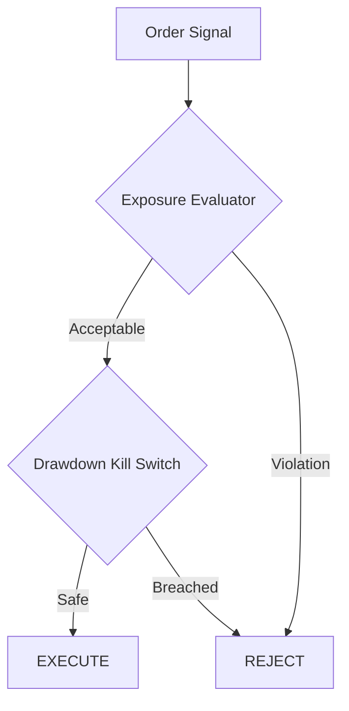

  <h1>Trade Risk Engine</h1>
  
<strong>Deterministic, Pure-Functional Capital Protection Evaluator</strong>

  
  

## Architecture

This engine evaluates capital execution targets entirely in-memory, relying on statically typed arrays to guarantee sub-millisecond execution times.

## Testing Protocol
Unit tests are written using `hypothesis` against 1,000+ randomized property parameters to guarantee integer overflow conditions never crash the evaluation loops.
