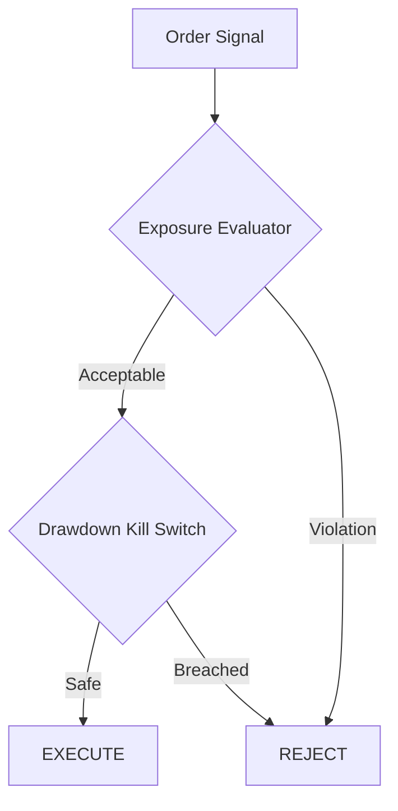

div align="center">
  <h1>Trade Risk Engine</h1>
  <p><strong>Deterministic, Pure-Functional Capital Protection Evaluator</strong></p>
  
  
</div>

## Architecture

This engine evaluates capital execution targets entirely in-memory to guarantee sub-millisecond execution times.



## Usage & Falsification Example

The engine protects trading capital by blocking trades that violate risk controls. Decisions are returned as a `RiskDecision` with `approved=False` and a specific reason code.

Here is a concrete example demonstrating **why and how** a bad trade is falsified and rejected by the drawdown gate (daily realized loss exceeding 10% maximum drawdown).

### Example Code

```python
from datetime import datetime, timedelta
from trade_risk_engine import RiskContext, RiskAuthority, Position, TradeOutcome

# 1. Initialize the Risk Context (frozen constraints)
ctx = RiskContext(
    max_daily_drawdown_pct=0.10,          # 10% daily drawdown limit
    max_correlated_exposure=2500.0,       # Max $2500 exposure per asset family
    consecutive_loss_limit=3,             # Block if 3 consecutive losses happen
    consecutive_loss_window_minutes=15.0  # within a 15-minute window
)

# --- SCENARIO A: Drawdown Gate Violation (Falsifying Example) ---
# Portfolio details: $100,000 total equity but we've already suffered a -$15,000 loss today.
equity = 100000.0
daily_realized_pnl = -15000.0  # -15% Daily Drawdown (breaches 10% limit)

decision = RiskAuthority.evaluate_trade(
    ctx=ctx,
    daily_realized_pnl=daily_realized_pnl,
    equity=equity,
    target_family="AAPL",
    proposed_cost=500.0,
    open_positions=[],
    expected_value=1.5
)

print(f"Approved: {decision.approved}")
# Output: Approved: False
print(f"Reason: {decision.reason_code}")
# Output: Reason: ERR_DAILY_DRAWDOWN: -15.00% exceeds limit -10.00%

# --- SCENARIO B: Consecutive Loss Gate Violation ---
# We have historical losses that trigger the freeze rule.
now = datetime.now()
trade_outcomes = [
    TradeOutcome(timestamp=now - timedelta(minutes=10), pnl=-50.0),
    TradeOutcome(timestamp=now - timedelta(minutes=7), pnl=-30.0),
    TradeOutcome(timestamp=now - timedelta(minutes=3), pnl=-10.0),
]

decision_cl = RiskAuthority.evaluate_trade(
    ctx=ctx,
    daily_realized_pnl=0.0,
    equity=100000.0,
    target_family="AAPL",
    proposed_cost=500.0,
    open_positions=[],
    expected_value=1.5,
    trade_outcomes=trade_outcomes,
    current_time=now
)

print(f"Approved: {decision_cl.approved}")
# Output: Approved: False
print(f"Reason: {decision_cl.reason_code}")
# Output: Reason: ERR_CONSECUTIVE_LOSS_LIMIT: 3 consecutive losses within 15.0 minutes
```

## Testing Protocol
Unit tests are written using `hypothesis` against 1,000+ randomized property parameters to guarantee integer overflow conditions never crash the evaluation loops.
